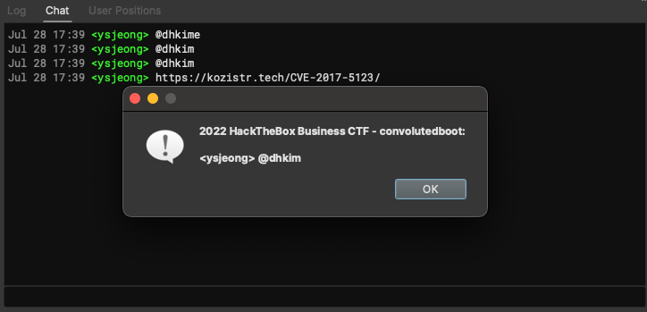

# binja_mention_notifier

## Server install

1. start `server.py` in your binaryninja enterprise server.
2. go to administrator panel, and make 'create chat' webhook to `http://[your binaryninja server ip]:[notifier server port]/webhook_event`

## Client install

1. just copy this repository to your binaryninja plugin's folder.
2. **I DON'T KNOW WHY, BUT YOU SHOULD DO THIS IN BINARYNINJA SETTINGS:**
    1. change Python Path Override option to your python interpreter.
    2. change Python Interpreter records to Python Path Override.
    3. (optional) change Python Virtual Environment Site-Packages .

## Usage

1. make sure that you connected to binaryninja enterprise server.
2. open file that you want to get mentioned by chat.
3. find `Start mention notifier` in plugin command lists.
4. now you can get notification by mentioning like `@d0now`
5. when you want to stop get notification, do plugin command `Stop mention notifier`

## ETC

Because I don't know how can I access properly to binary ninja enterprise's api server, There are some 'trick' implementation to get chat logs.
If you have any idea to improve this code, feel free to PR.
